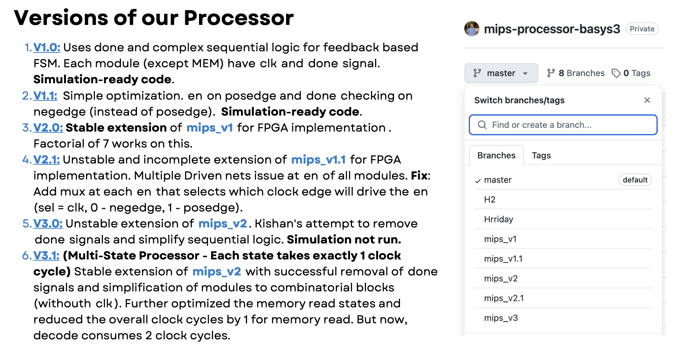
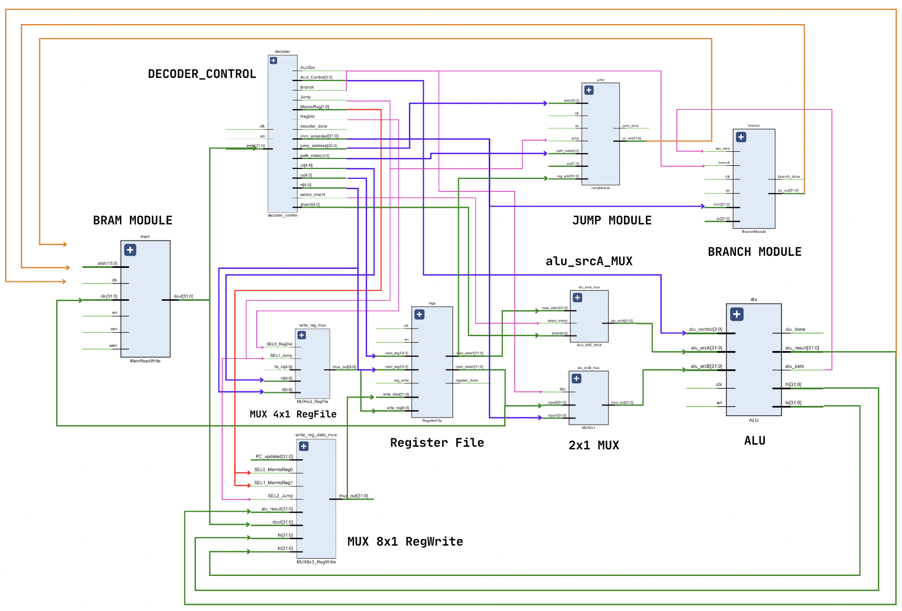
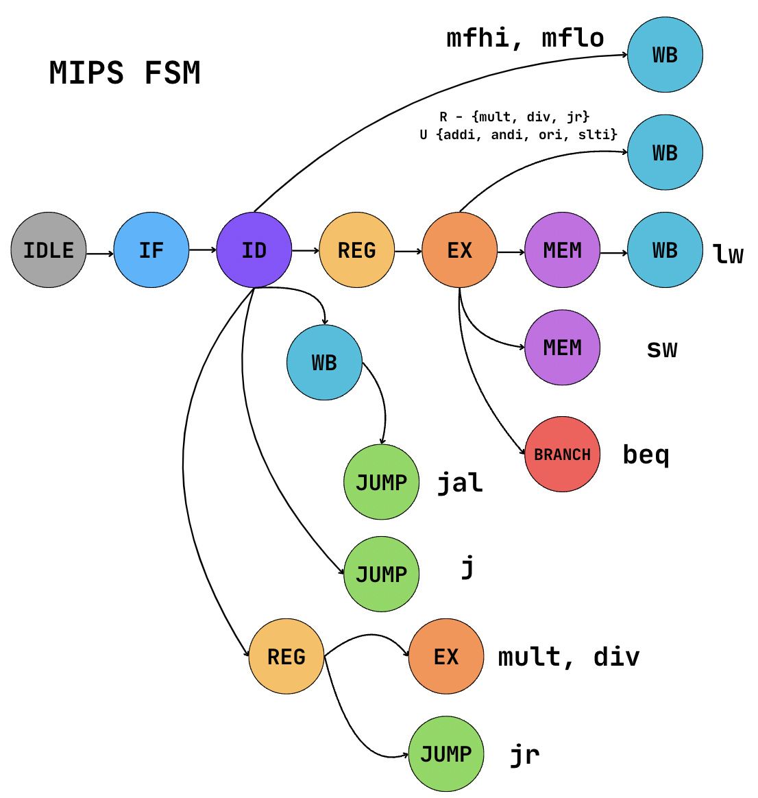
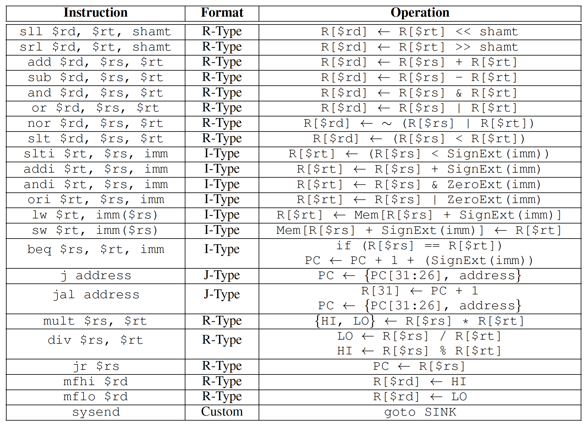

# mips-processor-basys3

### Team ALUminati - ES215 Computer Organization and Architecture

The processor is implemented on the Basys3 FPGA board. The datapath has been modified carefully to expand the ISA - allowing recursive programs to run as well.

Check out the final report [here]("./Final Report Team22 - ALUminati.pdf") and the final presentation [here]("./Final Presentation Team22 - ALUminati.pdf"), it includes video demonstration as well.

Some MIPS assembly codes are available in the `codes` directory. The `utils` directory contains a Python script to convert human-readable MIPS assembly code to machine code.

In the `utils` directory, write your human-readable MIPS assembly code in `mips_instructions.txt` run `coe_generator.py`

```bash
python3 ./utils/coe_generator.py
```

`data.coe` will be ready to be used in the FPGA and even the 32-bit machine code will be available in `mips_machine_code.txt`.

### Versions of the Processor

`mips_v3.2` is the stable and FPGA-implementation ready version of the MIPS processor.


### Modified Datapath



### The FSM



### The Complete ISA



## BRAM

<div align = "center">
    
</div>

<div align = "center">
    
</div>

## ALU

<div align = "center">
    
</div>

<div align = "center">
    
    
</div>

<div align = "center">
    
</div>

<div align = "center">
    
</div>

## Register File

<div align = "center">
    
</div>

## 2x1 MUX

<div align = "center">
    
</div>

## Factorial Waveform

<div align = "center">
    
</div>
